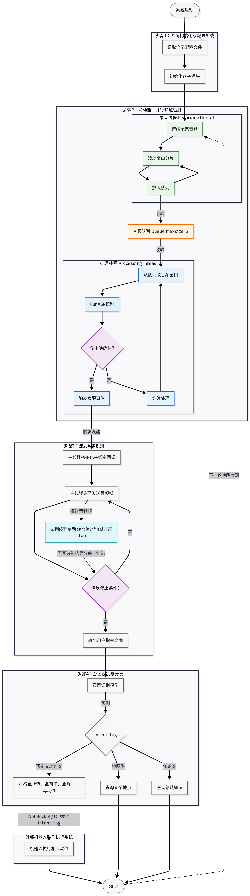
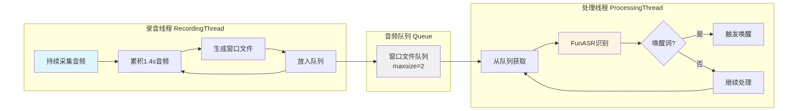

# 智能语音助手系统 (SmartVoice Assistant / SVA)

## 项目简介

智能语音助手系统是一个基于深度学习的多场景语音交互解决方案，集成了唤醒检测、语音识别、意图理解、知识库问答和语音合成等核心功能。系统采用模块化设计，通过YAML配置文件灵活适配不同应用场景，支持"爱跑哥"和"加油侠"两种业务场景。核心技术包括FunASR实时语音识别、千问大模型意图识别、Bailian/Dify RAG知识库检索、DashScope语音合成等。系统实现了滑动窗口并行唤醒检测、录音与识别线程并行处理、热词增强等创新技术，显著提升了唤醒响应速度和识别准确率。支持WebSocket和TCP两种通信方式，可灵活对接外部控制系统，适用于智能零售、加油站服务等多种商业场景。

## 系统流程图



## 安装步骤

### 1. 克隆项目

```bash
git clone <项目地址>
cd Vioce_Assistant
```

### 2. 创建Conda环境

```bash
conda create -n voice_assistant python==3.10
conda activate voice_assistant
```

### 3. 安装依赖

```bash
pip install -r requirements.txt
```

### 4. 下载FunASR模型

确保 `speech_seaco_paraformer_large_asr_nat-zh-cn-16k-common-vocab8404-pytorch` 目录存在，或修改配置文件中的模型路径。

## 使用方法

### 1. 配置YAML文件

编辑 `voice_assistant_config.yaml`，配置以下关键参数：

```yaml
# 基础配置
basic:
  wakeup_threshold: 1.0
  wakeup_record_duration: 1.4
  wakeup_overlap_duration: 0.7

# 通信配置
communication:
  type: "websocket"  # 或 "tcp"
  websocket:
    host: "localhost"
    port: 2626

# 意图识别配置（多角色支持）
intent:
  model: "tongyi-intent-detect-v3"
  scenario: "aipaoge"  # 当前使用的场景：aipaoge 或 jiayouxia
  roles:
    aipaoge:
      wakeup_word: "爱跑哥"  # 该角色的唤醒词
      audio_dir: "./gen_voice_dashscope_aipaoge"  # 音频文件存储路径
      intents:
        - tag: "C"
          instruction: "你好"
          description: "用户进行打招呼、寒暄或礼貌性问候"
          action:
            type: "tts"
            text: "尊敬的领导，欢迎光临中国石化易捷便利店。"
      wozai_audio: "./gen_voice_dashscope_aipaoge/tts_015.mp3"
      check_audio: "./gen_voice_dashscope_aipaoge/tts_check.wav"
    jiayouxia:
      wakeup_word: "加油侠"
      audio_dir: "./gen_voice_dashscope_jiayouxia"
      intents: [...]
      wozai_audio: "./gen_voice_dashscope_jiayouxia/tts_015.mp3"
      check_audio: "./gen_voice_dashscope_jiayouxia/tts_check.wav"

# RAG配置
rag:
  type: "bailian"  # 或 "dify"

# API密钥
api_keys:
  dashscope_api_key: "your_api_key"
  amap_api_key: "your_amap_key"
```

### 2. 运行程序

```bash
python voice_assistant.py
```

### 3. Python调用示例

```python
from voice_assistant import VoiceAssistant

# 使用默认配置文件
assistant = VoiceAssistant()
assistant.run()

# 注意：所有配置都在 voice_assistant_config.yaml 中，包括意图配置
# 如果需要使用不同的配置文件，可以指定 config_path
assistant = VoiceAssistant(config_path="./custom_config.yaml")
assistant.run()
```

## 配置场景说明

| 意图代码 | 爱跑哥场景 (aipaoge) | 加油侠场景 (jiayouxia) |
|---------|---------------------|----------------------|
| **A** | 地图查询（附近加油站、导航路线等） | 地图查询 |
| **B** | 知识库问答（事实性问题、信息查询） | 知识库问答 |
| **C** | 日常打招呼 | 日常打招呼 |
| **E** | 今日天气查询 | 今日天气查询 |
| **F** | 今日油价查询 | 今日油价查询 |
| **D1** | 拿水 | 拿咖啡 |
| **D2** | 拿可乐 | 拿啤酒 |
| **D3** | 拿蛋酥卷 | - |
| **D4** | 拿奥利奥 | - |
| **K1** | - | 答谢咖啡 |
| **K2** | - | 答谢啤酒 |
| **H** | 询问机器人名字 | 询问机器人名字 |

**预生成音频文件：**
- 爱跑哥场景：位于 `gen_voice_dashscope_aipaoge/` 目录
- 加油侠场景：位于 `gen_voice_dashscope_jiayouxia/` 目录
- 每个音频目录下都有 `map.jsonl` 文件，记录音频文件与文本的映射关系

## 项目目录说明

```
Vioce_Assistant/
├── voice_assistant.py              # 主程序入口
├── voice_assistant_config.yaml     # 主配置文件
├── config.py                       # 配置加载模块
├── wakeup_detector.py              # 唤醒检测模块
├── asr_engine.py                   # 语音识别引擎
├── tts_engine.py                   # 语音合成引擎
├── intent_detector.py              # 意图识别模块
├── rag_engine.py                   # RAG引擎（Bailian/Dify）
├── communication.py                # 通信模块（WebSocket/TCP）
├── audio_device.py                 # 音频设备管理
├── requirements.txt                # Python依赖包
├── gen_voice_dashscope_aipaoge/    # 爱跑哥场景音频文件（包含map.jsonl）
├── gen_voice_dashscope_jiayouxia/ # 加油侠场景音频文件（包含map.jsonl）
├── intent_manager.py               # 意图管理模块
├── speech_seaco_paraformer_*/     # FunASR模型目录
├── tmp_wav_file/                  # 临时音频文件目录
├── instruction_temp_file/          # 实时识别音频保存目录
└──── utils/                          # 工具脚本目录
```

## 核心功能与技术亮点

### 功能模块

| 模块 | 技术栈 | 核心功能 | 技术亮点 | 实现文件 |
|------|--------|---------|---------|---------|
| **唤醒检测** | FunASR | 滑动窗口并行检测、离线唤醒词识别、双线程架构 | 滑动窗口重叠检测、并行处理、零阻塞架构 | `wakeup_detector.py`<br/>`ParallelWakeupManager` |
| **语音识别** | FunASR<br/>DashScope ASR | 离线识别、实时流式识别、热词增强、句子结束检测 | 异步回调模式、录音与识别并行处理 | `asr_engine.py`<br/>`voice_assistant.py` |
| **语音合成** | DashScope TTS | 文本转语音、流式播报、多音色支持（知言/知甜/知哲） | 流式播报、多音色切换 | `tts_engine.py` |
| **知识库问答** | Bailian RAG<br/>Dify RAG | 多知识库检索、重排序优化、流式响应、场景适配 | RAG抽象接口、多实现支持 | `rag_engine.py` |
| **意图识别** | 通义千问 | 多意图分类、场景适配、JSON格式输出 | 场景适配、多意图分类 | `intent_detector.py` |
| **地图查询** | 高德地图API | 地址地理编码、附近POI搜索、加油站查询 | 地理编码、POI搜索 | `voice_assistant.py` |
| **通信接口** | WebSocket<br/>TCP | 客户端/服务器模式、控制指令、意图tag传输 | 通信抽象接口、多协议支持 | `communication.py` |
| **系统架构** | - | 模块化设计、配置驱动 | 接口抽象、YAML配置驱动、易于扩展 | `config.py`<br/>各模块接口 |
| **性能优化** | - | 模型预加载、资源管理 | 全局模型预加载、线程安全、减少延迟 | `voice_assistant.py` |
| **意图管理** | - | 多角色意图管理、动态配置 | 自动音频生成、map.jsonl维护、自动检测 | `intent_manager.py` |

### 核心技术详解

#### 1. 滑动窗口并行唤醒检测

**工作原理**

滑动窗口技术通过创建重叠的音频窗口来确保唤醒词不被遗漏。系统使用双线程架构：录音线程持续采集音频并生成窗口，处理线程并行识别每个窗口。

**滑动窗口时间轴示意图**

```
时间轴: 0.0s ──────────────────────────────────────────> 3.5s
        │
窗口1:  │████████████████ (1.4s)
        │
窗口2:  │      ████████████████ (1.4s, 从0.7s开始)
        │
窗口3:  │           ████████████████ (1.4s, 从1.4s开始)
        │
窗口4:  │                ████████████████ (1.4s, 从2.1s开始)
        │
重叠:   每个窗口重叠0.7s，确保唤醒词不被遗漏
```

**并行处理流程**



**技术细节**

- **窗口重叠**: 每个窗口时长1.4秒，重叠0.7秒，确保唤醒词无论出现在哪个位置都能被捕获
- **并行处理**: 录音线程和处理线程完全独立，通过 `Queue` 进行异步通信
- **优势**: 
  - 避免漏检：即使唤醒词跨越窗口边界也能被检测到
  - 响应快速：多个窗口并行识别，减少等待时间
  - 资源高效：利用多核CPU并行处理，提升检测效率

**实现**: `ParallelWakeupManager` 类，位于 `voice_assistant.py`

#### 2. 录音与识别的异步回调模式

**工作原理**

系统采用异步回调模式实现录音与识别的解耦处理。核心思想是：**录音线程持续录音，不等待识别结果；识别线程异步处理音频，完成后通过事件机制回调通知主线程**。

具体流程如下：

1. **录音线程（生产者）**：持续采集音频数据，将音频片段保存为临时文件后，立即放入队列并继续录音，**不等待识别完成**。录音线程只负责生产音频数据，完全独立运行。

2. **识别线程（消费者）**：从队列中异步获取音频文件，使用 FunASR 模型进行语音识别和唤醒词检测。识别过程是**异步执行**的，不会阻塞录音线程。

3. **异步回调机制**：当识别线程检测到唤醒词后，通过 `threading.Event` (`wakeup_event`) 触发回调，通知主线程唤醒事件已发生。主线程可以通过 `wait_for_wakeup()` 方法等待这个回调事件，实现非阻塞的唤醒检测。

这种设计实现了**真正的异步处理**：录音和识别完全并行，录音线程永远不会因为识别耗时而被阻塞，识别结果通过事件回调机制异步返回，确保了系统的高响应性和实时性。

**线程并行架构图**

[查看线程并行架构图](./asset/04_record_instruction与DashScope流式回调流程图.png)

**技术细节**

- **异步通信机制**: 
  - 使用 `Queue(maxsize=2)` 作为异步消息队列，录音线程 `put()` 放入音频文件路径，识别线程 `get()` 异步获取
  - 队列满时自动丢弃最旧文件，保证录音线程不被阻塞
  - 识别线程使用 `get(timeout=0.5)` 非阻塞获取，超时则继续循环等待

- **回调通知机制**: 
  - 识别线程检测到唤醒词后，设置共享状态（`wakeup_detected`、`detected_text`）
  - 通过 `wakeup_event.set()` 触发回调事件，通知等待的主线程
  - 主线程通过 `wait_for_wakeup()` 方法等待回调，支持超时设置，实现非阻塞等待

- **线程安全保护**: 
  - 使用 `threading.Lock` (`state_lock`) 保护共享状态（唤醒标志、识别文本等）
  - 使用 `threading.Event` (`wakeup_event`) 实现线程间的事件通知和回调
  - 使用 `threading.Event` (`stop_event`) 实现线程的优雅退出

- **异步处理的优势**:
  - **零阻塞**: 录音线程持续运行，不受识别耗时影响
  - **实时响应**: 识别结果通过事件回调立即通知，无需轮询
  - **资源高效**: 队列限制大小，自动清理临时文件，避免资源堆积

**实现**: `ParallelWakeupManager._recording_loop()` 和 `ParallelWakeupManager._processing_loop()` 方法

## 意图管理功能

系统支持通过配置文件动态管理意图，无需修改代码。所有配置都在 `voice_assistant_config.yaml` 的 `intent.roles` 部分。

### 核心特性

- **多角色管理**：支持为不同角色（aipaoge、jiayouxia）独立管理意图，每个角色有独立的唤醒词、意图配置和音频目录
- **自动音频生成**：如果音频文件不存在，自动调用TTS生成
- **自动检测音频**：从 `map.jsonl` 自动检测和恢复音频文件路径，无需手动指定 `audio_file` 字段
- **自定义音频目录**：为每个角色指定独立的音频存储路径（`audio_dir` 字段）
- **map.jsonl维护**：自动维护音频文件与文本的映射关系（添加、更新、删除意图时自动同步）

### 配置文件结构

```yaml
intent:
  model: tongyi-intent-detect-v3
  scenario: aipaoge  # 当前使用的场景
  roles:
    aipaoge:
      wakeup_word: 爱跑哥  # 该角色的唤醒词
      audio_dir: ./gen_voice_dashscope_aipaoge  # 音频存储路径
      intents:
        - tag: C
          instruction: 你好
          description: 用户进行打招呼、寒暄或礼貌性问候
          action:
            type: tts
            text: 尊敬的领导，欢迎光临中国石化易捷便利店。
            # audio_file 字段不需要指定，系统会自动从 map.jsonl 检测或生成
      wozai_audio: ./gen_voice_dashscope_aipaoge/tts_015.mp3
      check_audio: ./gen_voice_dashscope_aipaoge/tts_check.wav
```

### 使用方式

#### 1. 添加新意图

在 `voice_assistant_config.yaml` 的 `intent.roles.{role_name}.intents` 下添加：

```yaml
intents:
  - tag: L
    instruction: 帮我演示一下加油任务
    description: 用户请求演示加油任务
    action:
      type: tts
      text: 好的，现在开始演示。
```

#### 2. 更新意图

修改对应意图的 `text`、`instruction` 或 `description` 字段即可。

#### 3. 删除意图

从 `intents` 列表中删除对应条目即可。

#### 4. Python API 使用

```python
from intent_manager import IntentManager
from config import load_config

config = load_config('voice_assistant_config.yaml')
manager = IntentManager(
    main_config_path='voice_assistant_config.yaml',
    tts_config={
        'dashscope_voice': config.get('tts', {}).get('dashscope_voice', 'zhitian'),
        'dashscope_api_key': config.get('api_keys', {}).get('dashscope_api_key', '')
    }
)

# 添加意图
manager.add_intent('aipaoge', 'L', '帮我演示一下加油任务', '用户请求演示', '好的，现在开始演示。')

# 更新意图
manager.update_intent('aipaoge', 'L', action_text='新的播报文本')

# 删除意图
manager.delete_intent('aipaoge', 'L')
```

### map.jsonl 文件

每个角色的音频目录下自动维护 `map.jsonl` 文件（JSONL格式，每行一个JSON对象），记录音频文件与文本的映射关系：

```json
{"tag": "C", "filename": "tts_C_3141dd1e.wav", "text": "尊敬的领导，欢迎光临中国石化易捷便利店。", "instruction": "你好", "description": "用户进行打招呼、寒暄或礼貌性问候"}
```

系统会自动：
- 从 `map.jsonl` 检测和恢复音频文件路径
- 添加/更新/删除意图时自动同步 `map.jsonl`
- 如果音频文件不存在，自动生成并更新 `map.jsonl`

## 注意事项

1. **API密钥**: 确保在配置文件中正确设置DashScope、高德地图等API密钥
2. **模型路径**: 确保FunASR模型路径配置正确，或使用配置文件中提供的自动查找功能
3. **音频设备**: 系统会自动选择最佳音频输入设备（优先USB麦克风）
4. **依赖安装**: 确保所有依赖包已正确安装，特别是 `funasr`、`dashscope`、`PyAudio` 等
5. **CUDA支持**: 如需使用GPU加速，确保CUDA环境配置正确
6. **意图管理**: 
   - 所有意图配置都在 `voice_assistant_config.yaml` 的 `intent.roles` 部分
   - 系统会自动从 `map.jsonl` 检测音频文件，无需手动指定 `audio_file` 字段
   - 切换场景时，确保 `intent.scenario` 与要使用的角色名称匹配


